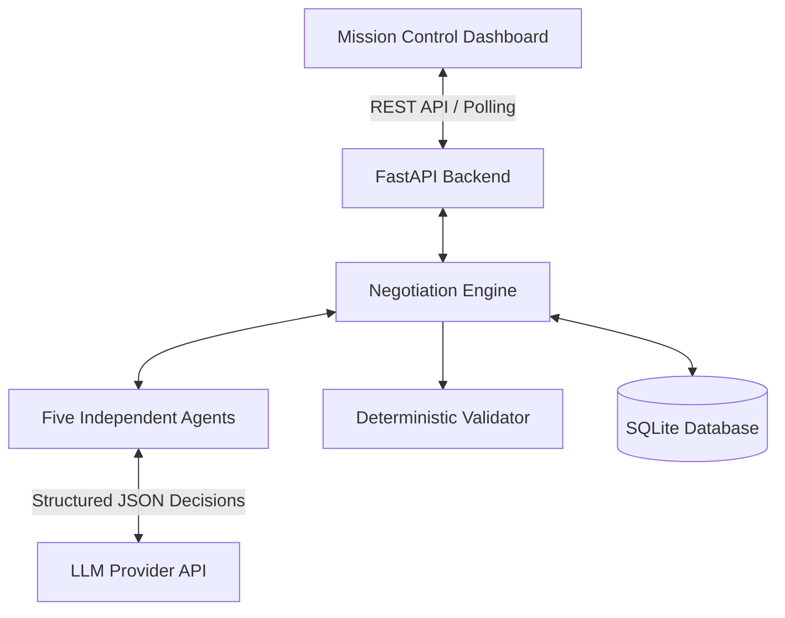

## 🌐 Live Demo

🚀 **Explore ARES ACCORD online:** [ARES ACCORD — Mission Control](https://ares-accord-backend.onrender.com/)

Experience the interactive Mars-colony negotiation dashboard, explore council roles, configure LLM settings, simulate crisis scenarios, and inspect resource allocation and validation results.

> **Note:** The live deployment may initially be idle. Start a crisis scenario to explore the negotiation workflow. If the service is waking from inactivity, allow a short time for it to load.

# 🚀 ARES ACCORD
### Multi-Agent Mars Colony Resource Negotiation Simulator

**An intelligent multi-agent negotiation system where autonomous departments negotiate scarce resources, respond to emergencies, and work toward a safe, validated mission plan.**

ARES ACCORD combines LLM-driven agent decisions, deterministic safety validation, auditable negotiation history, and a responsive Mars mission-control dashboard.

Five specialized agents — **Commander, Life Support, Medical, Food, and Engineering** — negotiate a shared resource pool. The Commander can approve a plan only when the deterministic validator passes and **all four department agents ACCEPT the same plan version**.

---

## 📌 Table of Contents

- [Key Features](#-key-features)
- [Meet the Team](#-meet-the-team)
- [System Architecture](#-system-architecture)
- [Mission Control Dashboard](#-mission-control-dashboard)
- [Agent-to-Agent Negotiation](#-agent-to-agent-negotiation)
- [LLM Configuration](#-llm-configuration)
- [Supported Providers](#-supported-providers)
- [Getting Started](#-getting-started)
- [API Reference](#-api-reference)
- [Testing and Verification](#-testing-and-verification)
- [Official Starter-Kit Compatibility](#-official-starter-kit-compatibility)
- [Professional Audit and Reliability](#-professional-audit-and-reliability)
- [Known Limitations](#-known-limitations)
- [Documentation](#-documentation)

---

## ✨ Key Features

| Feature | Description |
|---|---|
| 🤖 **Five Autonomous Agents** | Independent departmental goals, state, decision history, and negotiation behavior. |
| 🛡️ **Deterministic Safety Validation** | Rule-based validation prevents unsafe or invalid plans from being approved. |
| 🗳️ **Consensus-Based Approval** | Requires a valid plan and four matching ACCEPT votes for the same plan version. |
| 🔄 **Multi-Round Negotiation** | Supports counteroffers, commitments, agent objections, and alternative plans. |
| 🚨 **Dynamic Crisis Injection** | Introduce emergencies during negotiation and trigger replanning. |
| 🧾 **Auditable Decision History** | Persist negotiation transcripts, state changes, plan versions, and event history. |
| 🧠 **LLM-Powered Decisions** | Department agents use structured model responses for requests, counteroffers, commitments, and votes. |
| 🔁 **Reliable Rule-Based Fallback** | Continue operating when LLM integration is disabled or model calls fail. |
| 📊 **Evidence Export** | Export negotiation evidence in JSON and CSV formats. |
| 🪐 **Responsive Mission Control UI** | Deep-space visual design, live transcript, agent identities, voting indicators, and crisis controls. |

### Safety-First Approval

ARES ACCORD separates intelligent negotiation from authoritative safety checks.

- **PASS + four matching ACCEPT votes:** The plan may be approved.
- **Validator FAIL:** The plan cannot be approved, regardless of an LLM's response.
- **Any department rejects:** The Commander tries another candidate plan with a new version and cleared votes.
- **Emergency injected:** Previous approvals and accepted commitments are invalidated, and the plan becomes stale until renegotiation.
- **No feasible plan:** The system reports `INFEASIBLE` with constraint shortfalls.
- **Negotiation reaches its round limit:** The system can report `DEADLOCK`.

The LLM proposes and evaluates decisions; deterministic application logic remains responsible for safety and approval.

---

## 👥 Meet the Team

| Team Member | Responsibility |
|---|---|
| Muhammad Ahmed Subhani | Backend Development |
| Muhammad Tashfeen Subhani | Frontend Development |
| Taimoor Abdullah | Demonstration |
| Muhammad Labeeq | Testing |

📄 See [`TEAM_DECLARATION.md`](TEAM_DECLARATION.md) for the official team declaration.

---

## 🏗️ System Architecture



### Core Components

| Component | Responsibility |
|---|---|
| `backend/app/rules.py` | Fixed-mode resource packages, deterministic validation, 81-combination search, and infeasibility analysis. |
| `backend/app/agents.py` | Independent agent goals, state, history, decisions, and departmental behavior. |
| `backend/app/engine.py` | Message routing, negotiation rounds, candidate selection, plan versions, and timeouts. |
| `backend/app/store.py` | SQLite persistence for application state and negotiation transcripts. |
| `backend/app/llm.py` | LLM provider integration and structured decision handling. |
| `web/index.html` | Main interactive mission-control dashboard. |
| `frontend/` | Optional Streamlit client. |

### LLM Decision Integrity

The LLM integration supports structured JSON decisions for:

- Departmental mode requests and counteroffers.
- Sacrifice positions and commitment acceptance.
- Departmental votes on proposed plans.
- Commander selection among validator-approved candidate plans.

Responses are schema-checked. Failed or invalid calls are identified as `rule-fallback` where fallback behavior applies.

Malformed commitment decisions are treated as not accepted, and malformed votes are treated as `REJECT`. A department can reject an otherwise valid plan, prompting the Commander to consider another candidate.

When LLM mode is disabled, deterministic ACCEPT decisions are explicitly labelled `rule`.

**Critical boundary:** No LLM response can override a failed deterministic validator or independently authorize final approval.

---

## 🪐 Mission Control Dashboard

ARES ACCORD provides a responsive, interactive interface designed around a deep-space and Mars-colony atmosphere.

### Dashboard Highlights

- Translucent mission panels and a dark, space-inspired visual theme.
- Responsive layouts for desktop, tablet, and mobile screens.
- Current-scenario status and live negotiation transcript.
- Distinct identity colors for each council role.
- Clear ACCEPT and REJECT vote indicators.
- Agent-to-agent communication arrows and speech bubbles.
- Crisis presets and emergency-event injection controls.
- LLM configuration accessible from the dashboard.
- Keyboard-accessible crisis presets and LLM settings.
- Dynamic-content escaping for transcript-derived HTML and SVG elements.

### Live State and Recovery

The dashboard and backend include safeguards for important state transitions:

- Refresh negotiation status even when the final transcript message arrives before the completed state is fetched.
- Stop the live indicator when a run finishes without repeatedly restarting its animation.
- Handle worker failures and interrupted negotiations.
- Recover and record interrupted runs after a server restart.
- Prevent resets while negotiation is active.
- Invalidate stale votes and accepted commitments after emergency injection.
- Validate return promises against the published commitment text.
- Parse JSON responses defensively and validate API inputs.

These measures improve reliability during interactive demonstrations and repeated negotiation scenarios.

---

## 🤝 Agent-to-Agent Negotiation

Agents communicate through messages that identify their intended recipient using the `to` field.

When a department needs another department to make a sacrifice:

1. The requesting department addresses the return owner directly.
2. The owner responds with a commitment or objection.
3. The exchange is recorded in the negotiation transcript.
4. The dashboard visualizes the communication between agents.
5. A derived cooperation index reflects positive and negative negotiation behavior.

The cooperation index increases with commitments and accepted votes and decreases with refusals and rejected votes.

This design makes negotiation behavior observable rather than hiding it behind a final resource allocation.

---

## 🔑 LLM Configuration

ARES ACCORD can run with an LLM provider or in labelled rule-based fallback mode.

### Option 1 — Configure Through the Dashboard

1. Start the application.
2. Open the dashboard at `http://localhost:8000`.
3. Open **LLM Settings** in the sidebar.
4. Select a provider.
5. Enter the corresponding API key.
6. Select or configure the model.
7. Press **Test** to verify the configuration.
8. Press **Save** to apply it.

The dashboard configuration keeps the API key in backend memory only; do not assume it persists across server restarts.

### Option 2 — Configure Environment Variables

Create a local `.env` file from the example:

```bash
cp .env.example .env
```

Configure the required values in your local environment:

```env
ARES_LLM_API_KEY=your_api_key_here
ARES_LLM_PROVIDER=anthropic
ARES_LLM_MODEL=your_model_id
```

The values above are examples, not real credentials. Use the provider and model identifiers supported by your current implementation.

**Security:** Never commit `.env` files, API keys, access tokens, or private credentials to GitHub. Use `.env.example` to document variable names without including secrets.

### Running Without an API Key

The simulator supports labelled rule-based fallback operation when a key is unavailable or LLM mode is disabled.

This allows deterministic testing and demonstrations without depending on a live model-provider request. Model-powered decisions require a valid provider configuration.

---

## 🌐 Supported Providers

ARES ACCORD supports the following provider integrations:

- Anthropic
- Google Gemini
- OpenAI
- Groq
- OpenRouter
- Ollama

Anthropic is the default provider configuration. Gemini uses an OpenAI-compatible endpoint in the current implementation.

**Note:** Model availability and identifiers change over time. Use the dashboard's **Test** action to verify the selected provider, model, and credentials. Ollama requires a compatible local service and model.

---

## 🚀 Getting Started

### Prerequisites

- Python installed and available on your system `PATH`.
- Git, if cloning the repository.
- Internet access and a valid API key if using a hosted LLM provider.
- Docker and Docker Compose, if using the containerized setup.

### 1. Install Dependencies

Run the following command from the repository root:

```bash
pip install -r backend/requirements.txt -r frontend/requirements.txt
```

### 2. Start the Backend and Dashboard

```bash
cd backend
python -m uvicorn app.main:app --port 8000
```

Open the application:

**Dashboard:** http://localhost:8000

**Interactive API documentation:** http://localhost:8000/docs

### Alternative Startup Methods

From the repository root, you can also use the available startup scripts or Docker Compose:

```bash
docker compose up --build
```

Alternatively, use `run.bat` on Windows or `run.sh` on compatible Unix-like systems.

### Reset the Simulation

Use the dashboard's **Reset** button or call the reset endpoint:

```http
POST /api/reset
```

Deleting `ares.db` also removes the file-backed database state, but stop the application first and make sure you no longer need its persisted evidence.

---

## 🔌 API Reference

The backend exposes REST endpoints for simulation control, state inspection, event injection, and evidence export.

| Method | Endpoint | Purpose |
|---|---|---|
| `GET` | `/api/state` | Retrieve current simulation state. |
| `GET` | `/api/transcript?since=` | Retrieve transcript entries from a specified position. |
| `GET` | `/api/modes` | Retrieve available resource-allocation modes. |
| `POST` | `/api/start` | Start a negotiation using the supplied pool and policy. |
| `POST` | `/api/event` | Inject a crisis or resource-impact event. |
| `POST` | `/api/reset` | Reset the simulation when permitted. |
| `GET` | `/api/export/json` | Export structured JSON evidence. |
| `GET` | `/api/export/csv` | Export CSV evidence. |
| `GET` | `/api/ready` | Check application readiness. |
| `GET` | `/api/metrics` | Retrieve operational metrics. |

### Event Injection

The `/api/event` endpoint accepts the dashboard's five-integer `delta` shortcut and the supported structured event envelope.

Structured event fields include:

- `event_id`
- `event_name`
- `trigger_time`
- `description`
- `impact`
- `requires_replan`
- `message_to_commander`

Supported structured power-reduction events are conservatively translated into a power-pool reduction for replanning, with event metadata retained in the history.

Refer to [`docs/STARTER_KIT_COMPATIBILITY.md`](docs/STARTER_KIT_COMPATIBILITY.md) for implementation details.

---

## 🧪 Testing and Verification

Run the backend regression suite from the repository root:

```bash
cd backend
python -m pytest -q tests
```

### Test Coverage

The regression suite covers the following areas:

- Baseline plan approval and agent refusal.
- Multi-round negotiation and commitment handling.
- Four-agent consensus requirements.
- Stale-vote prevention after plan changes.
- Emergency-event renegotiation.
- Infeasibility detection and shortfall reporting.
- Strict API input validation.
- Rejection of booleans masquerading as integers.
- LLM JSON parsing and invalid-response handling.
- Worker-failure recovery and interrupted-run handling.
- Reset guards and restart recovery.
- Return-promise validation.
- Security headers and readiness/metrics endpoints.
- JSON and CSV evidence exports.
- CSV formula-injection protection.
- Exhaustive validation of all 81 fixed-package combinations.

### Manual Crisis Demonstration

Use this sequence to demonstrate the main negotiation lifecycle:

1. Start a crisis scenario.
2. Observe the negotiation rounds and candidate plan versions.
3. Confirm the baseline approval when the scenario permits it.
4. Inject an emergency event with resource deltas.
5. Verify that the existing plan becomes `STALE` and previous approval state is invalidated.
6. Observe the agents renegotiate and vote on a new plan.
7. Verify that a new plan is approved only after validation and matching ACCEPT votes.

Also test an infeasible scenario and verify that the system reports the blocking constraint and relevant shortfalls.

---

## 📦 Official Starter-Kit Compatibility

ARES ACCORD includes compatibility with the official starter-kit event format and evidence structure.

- Accepts the supported structured event envelope and the dashboard's resource-delta shortcut.
- Retains structured event metadata in event history.
- Translates supported power-reduction events into a conservative power-pool reduction for replanning.
- Includes `starter_kit_records` in JSON evidence exports, shaped around the starter-kit output example.

Relevant files:

- [`schemas/`](schemas/)
- [`docs/STARTER_KIT_COMPATIBILITY.md`](docs/STARTER_KIT_COMPATIBILITY.md)

---

## 🔒 Professional Audit and Reliability

The professional audit release includes several reliability and security improvements:

- HTTP security headers.
- No-store caching for API responses.
- Operational readiness and metrics endpoints.
- Versioned JSON evidence exports with UTC timestamps, named resources, and derived metrics.
- Strict input validation before type coercion.
- SQLite busy timeout and Write-Ahead Logging (WAL) mode for file-backed storage.
- Transcript-derived HTML and SVG escaping.
- Improved worker-failure handling and restart recovery.
- Repeatable live-demonstration and competitive-review documentation.

These measures strengthen operational visibility, evidence integrity, and defensive handling of application inputs.

---

## ⚠️ Known Limitations

- **LLM latency and cost:** A negotiation may involve approximately 35 model calls. Department-agent calls run in parallel where supported.
- **External dependencies:** Live model decisions depend on provider availability, network connectivity, credentials, and model compatibility.
- **Fallback behavior:** Rule-based fallback improves reproducibility but is not equivalent to LLM-driven negotiation.
- **Single-process state:** The current application is designed around one active scenario in a single process; it is not a distributed multi-instance deployment.
- **Provider changes:** Model identifiers, API behavior, and pricing may change over time.
- **External validation:** Automated tests do not, by themselves, establish that a live external model-provider call has been verified.

---

## 📚 Documentation

Explore the repository documentation for additional implementation and review details:

| Document | Purpose |
|---|---|
| [`TEAM_DECLARATION.md`](TEAM_DECLARATION.md) | Team declaration and responsibilities. |
| [`docs/architecture.md`](docs/architecture.md) | Architecture and system design boundaries. |
| [`docs/audit-report.md`](docs/audit-report.md) | Previous audit findings and review notes. |
| [`docs/competitive-review.md`](docs/competitive-review.md) | Competitive review and repeatable demonstration checklist. |
| [`docs/STARTER_KIT_COMPATIBILITY.md`](docs/STARTER_KIT_COMPATIBILITY.md) | Official starter-kit compatibility details. |

---

## 🌌 ARES ACCORD

**Five departments. One shared resource pool. A mission that cannot afford an unsafe decision.**

ARES ACCORD explores how autonomous agents can negotiate competing priorities while remaining accountable to deterministic rules, shared commitments, and auditable outcomes.

The objective is not simply to find a plan — it is to find a plan that can be validated, agreed upon, and defended by evidence.
