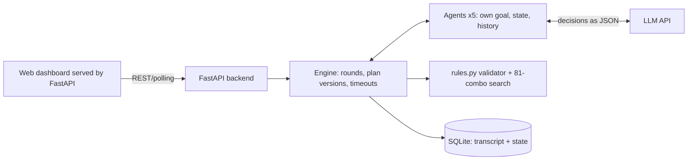

# ARES ACCORD — Integrated Professional Release

**A multi-agent Mars-colony resource negotiation simulator built around deterministic safety validation, auditable agent decisions, and a responsive mission-control dashboard.**

Five agents (Commander, Life Support, Medical, Food, Engineering) negotiate a shared resource pool.

## Team

- Muhammad Ahmed Subhani — Backend
- Muhammad Tashfeen Subhani — Frontend
- Taimoor Abdullah — Demo
- Muhammad Labeeq — Testing

See [`TEAM_DECLARATION.md`](TEAM_DECLARATION.md) for the team declaration.
The Commander can only approve a plan when a **deterministic validator** passes and **all four agents ACCEPT the same plan version**.

## Architecture

- `backend/app/rules.py` fixed mode packages, validator, search, INFEASIBLE analysis (no model involved)
- `backend/app/agents.py` independent agents; `engine.py` message bus + negotiation loop; `store.py` persistence
- `backend/app/llm.py` LLM client (Anthropic or any OpenAI-compatible API). Each department agent decides its **mode request, counteroffer, sacrifice stance, commitment acceptance and vote** via the LLM as structured JSON; the Commander chooses among validator-approved candidate plans. Output is schema-checked; invalid/failed calls are labelled `rule-fallback`. Crucially, an invalid LLM response cannot manufacture consent: malformed commitment decisions are treated as not accepted, and malformed votes are treated as REJECT. Deterministic ACCEPT decisions are only used when LLM mode is disabled and are labelled `rule`. An agent can REJECT a valid plan, which makes the Commander try the next candidate (new version, votes cleared). The LLM can never approve an invalid plan: validator FAIL forces REJECT and approval needs PASS + 4 matching ACCEPT votes.

## Dashboard UI
The v7 audit hardens API input validation, blocks resets during active negotiation, invalidates old votes and accepted commitments on emergency injection, validates return promises against the published text, records interrupted runs after a server restart, and escapes transcript-derived SVG labels. The full review build also fixes the live dashboard state-refresh bug: when the backend finishes after the final transcript message has already been fetched, the UI still refreshes its running/status state and removes the live indicator without restarting its animation on every poll. It also hardens worker-failure state handling, JSON response parsing, and transcript-derived HTML attributes. The dashboard uses a deep-space/Mars atmosphere with translucent mission panels, responsive desktop/tablet/mobile layouts, a current-scenario indicator, and an empty-state guide for the live transcript. Council roles have distinct identity-color outlines; the outer vote ring shows ACCEPT or REJECT without placing checkmarks over the agents. The mode board repeats each agent’s vote in text, and the live transcript escapes dynamic content before rendering. Keyboard users can operate the crisis presets and open LLM settings without a mouse.

## Configure the LLM
Easiest: open the dashboard sidebar -> **LLM settings**, pick a provider, paste the API key, press **Test** then **Save** (key stays in backend memory only). Alternatives:
`cp .env.example .env`, set `ARES_LLM_API_KEY` (and `ARES_LLM_PROVIDER`/`ARES_LLM_MODEL`), then export the variables (or use your shell/Docker env) before starting the backend. Without a key the system runs in labelled rule-based fallback mode.

## Agent-to-agent dialogue
Messages carry a recipient (`to`). When a sacrifice is needed, the sacrificing department **speaks directly to each return owner** (`@Engineering ...`), the owner answers with a commitment or an objection addressed back, and the dashboard draws these exchanges as live arrows between agents with a speech bubble. Departments also get a derived *cooperation index* (commitments, accepted votes up; refusals and rejected votes down).

## Providers
Anthropic (default `claude-sonnet-5`), **Gemini** (OpenAI-compatible endpoint, default `gemini-3.8-flash`), OpenAI, Groq, OpenRouter, Ollama. Model IDs change over time; use the provider Test action to verify the selected model and key. Pick one in the dashboard LLM settings and press Test.

## Run
```
pip install -r backend/requirements.txt -r frontend/requirements.txt
cd backend && python -m uvicorn app.main:app --port 8000   # dashboard + API -> http://localhost:8000
```
Or `run.bat` / `run.sh`, or `docker compose up --build`. API docs: http://localhost:8000/docs.
**Reset:** the dashboard's Reset button (or `POST /api/reset`, or delete `ares.db`).

## API
`GET /api/state` · `GET /api/transcript?since=` · `GET /api/modes` · `POST /api/start {pool,policy}` · `POST /api/event {name,delta[5],allow_override}` · `POST /api/reset` · `GET /api/export/json|csv`

(`frontend/` holds an optional Streamlit client; the main UI is `web/index.html`.)

## Test
`cd backend && python -m pytest -q tests` (**regression tests** covering worker failure recovery, strict API validation, LLM JSON parsing, security headers, readiness/metrics, exports, CSV formula-injection protection, and exhaustive checks over all 81 fixed-package combinations) (baseline approval, refusal, 2 commitments, 4 votes, stale-vote blocking, event renegotiation, invalid-input rejection, reset guards, restart recovery, exact return promises, INFEASIBLE).
Manual: Start crisis → 4 rounds, v2 approved → inject event (any deltas) → STALE → new approval, or INFEASIBLE with the blocking constraint.

## Known limitations
LLM latency/cost scales with ~35 calls per negotiation (department calls run in parallel); the fallback keeps runs reproducible if the model or network fails. State is single-process (one active scenario). Never commit `.env`.


## Official starter-kit compatibility\n\nThe `/api/event` endpoint accepts both the dashboard's five-integer `delta` shortcut and the official structured event envelope (`event_id`, `event_name`, `trigger_time`, `description`, `impact`, `requires_replan`, and `message_to_commander`). Structured power-reduction events are conservatively translated into a power-pool reduction for replanning; event metadata is retained in the event history. JSON evidence export includes `starter_kit_records` shaped around the starter-kit output example. See `schemas/` and `docs/STARTER_KIT_COMPATIBILITY.md`.\n\n## Professional audit release additions

- API security headers and no-store caching for API responses.
- `/api/ready` and `/api/metrics` endpoints for operational visibility.
- Versioned JSON evidence export with UTC timestamp, named resources, and derived metrics.
- Strict pre-coercion checks reject boolean values masquerading as integers.
- SQLite busy timeout and WAL mode for file-backed storage.
- Competitive review and repeatable live-demo checklist: `docs/competitive-review.md`.

See `docs/audit-report.md` for prior review findings and `docs/architecture.md` for design boundaries. A live external model-provider call is not assumed to be verified by the automated tests.
